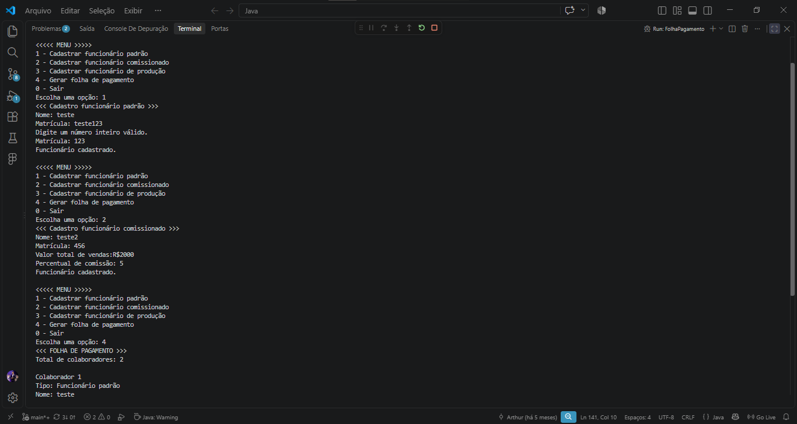

# Projeto de Faculdade.
Um projeto desenvolvido inteiramente através da linguagem JAVA, afim de, rodar diretamente pelo terminal(sem uma interface para front-end).  
Projeto se trata de um sistema de cadastro de tipos de funcionários diferentes, cada um com seu nome, matricula, salário e algo a mais relacionado ao tipo de funcionário escolhido. 
Os dados inseridos ficam armazenados em um Array, que pode ser chamado atraés da opção "Gerar folha de pagamento", onde é gerado uma folha de pagamento com os dados de todos cadastrados e seu salário final + extras
 

